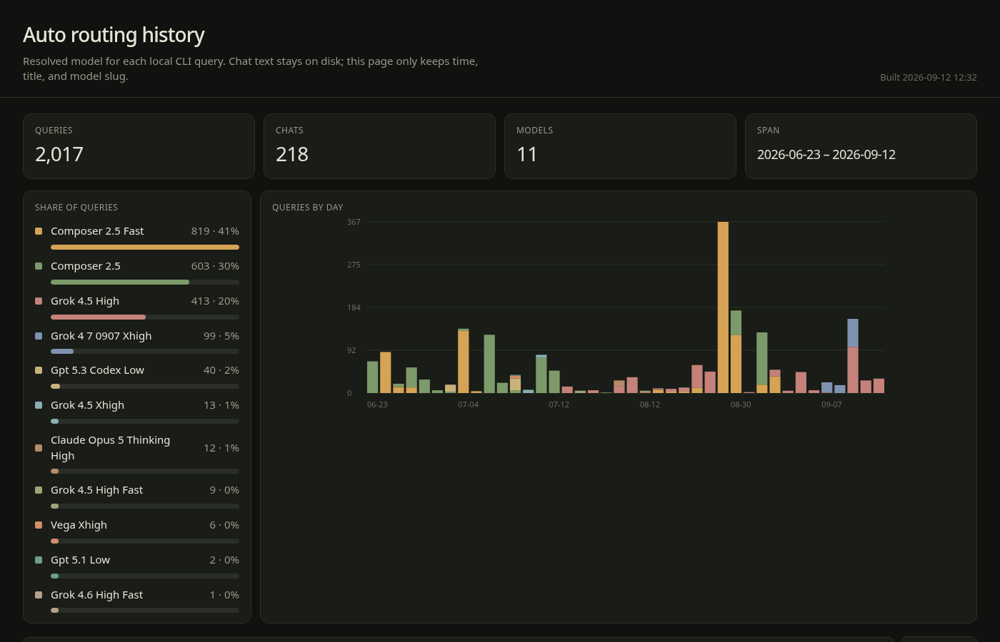

# cursor-model-history

Local dashboard of which models Cursor Auto routed your chats to.

Reads `~/.cursor/chats/*/store.db` and writes `dashboard.html`. It records timestamps, chat titles, and model slugs only — never message text.

## Example

Screenshot from a local build showing Auto routing including **`grok-4-7-0907-xhigh`**:



## Usage

```bash
python3 build.py
xdg-open dashboard.html   # or open dashboard.html in a browser
```

Re-run `build.py` whenever you want fresh data.
